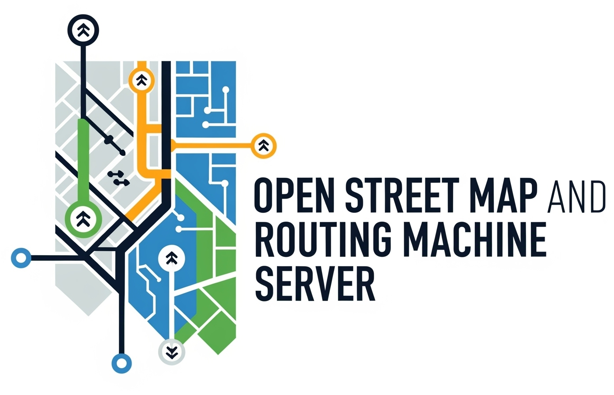

# Open Street Map and Routing Machine Server



[](https://gitlab.com/opentasmania/osm-osrm-server/-/releases)

[](https://gitlab.com/opentasmania/osm-osrm-server/-/tags)

**Date:** 2025-06-26

**Primary Maintainer:** [Peter Lawler (relwalretep@gmail.com)](mailto:relwalretep@gmail.com)]

**Location Context:** Developed with a focus on Tasmania, Australia, but adaptable for other regions.

**Licence:** [LGPL3+](LICENCE.txt)

## 1. Overview

This project provides a complete self-hosted OpenStreetMap system. It
ingests [OpenStreetMap](https://www.openstreetmap.org/) (OSM) data for base maps and routing networks. The system serves
map tiles (both vector and raster), provides turn-by-turn routing (including for routes
via [OSRM](https://project-osrm.org/)). It adds [GTFS](https://gtfs.org/) data as an example of additional data that can
be ingested and makes this data queryable through
a [PostgreSQL](https://www.postgresql.org/)/[PostGIS](https://postgis.net/) database.

The entire stack is designed to run on a dedicated [Debian 13 "Trixie"](http://debian.org/) system.

## 2. System Architecture

The system is deployed on a GNU/Linux system with the following key components:

* **Development Environment:** [Python](https://www.python.org/) package (`gtfs_processor`) managed with `uv` and
  defined by `pyproject.toml`, suitable for development in IDEs like [PyCharm](https://www.jetbrains.com/pycharm/).
* **Database:** 
  * PostgreSQL with PostGIS and HStore extensions for storing OSM and GTFS data.
  * pgAdmin for database administration through a web interface. (Work in progress)
  * pgAgent for scheduling and executing PostgreSQL jobs. (Work in progress)
* **Routing Engine:**
    * The `osrm/osrm-backend` [Docker](https://www.docker.com/) image is used, primarily due to dependency issues in
      development.
    * [OSM PBF](https://wiki.openstreetmap.org/wiki/PBF_Format) data is preprocessed using tools within the Docker
      image.
    * `osrm-routed` runs inside a Docker container managed by a `systemd` service, exposing port 5000 locally.
* **Map Tile Serving:**
    * Vector Tiles via [pg_tileserv](https://github.com/CrunchyData/pg_tileserv) serving vector tiles directly from
      PostGIS. Runs as a `systemd` service.
    * Raster Tiles via a classic OpenStreetMap stack ([Mapnik](https://mapnik.org/), `renderd` tile rendering daemon,
      `mod_tile` serving raster tiles with [Apache2](https://httpd.apache.org/), OpenStreetMap-Carto stylesheet for
      rendering. Runs as a `systemd` service (typically on port 8080 if Nginx is primary).
* **Web Access:** [nginx](https://nginx.org/) as a reverse proxy for all services.
* **SSL Certificate:** [Certbot](https://certbot.eff.org/) (typically on ports 80/443), routing requests to the
  appropriate backend services (`pg_tileserv`, Apache/`mod_tile`, OSRM). Handles SSL termination.
* **GTFS Data Management:**
    * Automated download and import of GTFS static feeds into PostGIS.
    * Python-based [ETL pipeline](https://en.wikipedia.org/wiki/Extract,_transform,_load) for processing, validating,
      cleaning GTFS data, and handling problematic records via
      [Dead-Letter Queues](https://en.wikipedia.org/wiki/Dead_letter_queue) (DLQ).
    * A cron job triggers updates.
    * (Future) GTFS-Realtime processing.
* **UFW (Uncomplicated Firewall):** Configured for basic security.
* **Other Data Sources**
    * Investigate using other file formats for known routing paths.

## 3. Setup Instructions

### Quick Start

1. Check for essential preqrequisites:
    * Update the system package lists.
    * Upgrade the system if required to ensure the latest packages are installed.
    * Tests to see if basic python3 capability is available, and if not install it.
    * Install python3-apt, which is required for the AptManager module.

```bash
sudo apt --yes update
sudo apt --yes upgrade
if ! dpkg -s python3 > /dev/null 2>&1 || ! dpkg -s python3-dev > /dev/null 2>&1; then 
  echo "python3 and/or python3-dev not found. Proceeding with installation..."
  sudo apt update && sudo apt --yes install python3 python3-dev
else
   echo "python3 and python3-dev are already installed."
fi

# Install python3-apt which is required for the AptManager
if ! dpkg -s python3-apt > /dev/null 2>&1; then
  echo "python3-apt not found. Proceeding with installation..."
  sudo apt --yes install python3-apt
else
  echo "python3-apt is already installed."
fi
```

2. Run the installer
    * Checks for required Python packages
    * Prompts to install any missing packages using sudo apt install
    * Uses the modular installer framework to install components

```bash
python3 install.py install postgres nginx apache osrm
```

### Installer help

To obtain install configuration options and associated help text, use this command:

```bash
python3 install.py --help
```

This will display the following help text:

```
usage: install.py [-h] [-v] {list,install,uninstall,status} ...
Installer for OSM-OSRM Server

positional arguments:
  {list,install,uninstall,status}
                        Command to execute
    list                List available installers
    install             Install components
    uninstall           Uninstall components
    status              Check installation status of components

options:
  -h, --help            show this help message and exit
  -v, --verbose         Enable verbose output
```

For more detailed help on a specific command, use:

```bash
python3 install.py <command> --help
```

For example:

```bash
python3 install.py install --help
```

This will display help for the install command, showing what components can be installed.

---

### Detailed Setup

The setup process is designed to be followed sequentially.

* **System Foundation - Debian 12**
    * Initial OS configuration, updates, and essential package installations (including all anticipated dependencies for
      subsequent services via a single `apt` command).
    * Firewall (`ufw`) setup.

* **Service Installation & Configuration]**
    * PostgreSQL and PostGIS.
    * OSRM (Docker setup to be detailed here).
    * `pg_tileserv` (Vector Tiles).
    * Raster Tile Stack (Apache2, `mod_tile`, `renderd`, Mapnik, OpenStreetMap-Carto stylesheet).
    * Nginx (Reverse Proxy).
    * `systemd` service definitions.

* **Initial Data Import, Processing & GTFS Automation**
    * Downloading and importing OpenStreetMap (OSM) PBF data into PostGIS using `osm2pgsql`.
    * Preprocessing the OSM PBF data for OSRM using the OSRM Docker image tools (`osrm-extract`, `osrm-partition`,
      `osrm-customize`).
    * Performing the initial GTFS data import using the Python package.
    * Configuring the cron job for automated GTFS updates.
    * (Optional) Pre-rendering raster tiles.

## 4. Project Structure

1. [Installer](install.py)
    * Modular installer framework for the OSM-OSRM Server.
    * Installs and configures all components.
    * Imports data from processors.
2. Submodules
    * [GTFS processor](installer/processors/plugins/importers/transit/gtfs) Python package to import GTFS data into the postgis
      database on which
      the mapping data exists.

## 5. History

This project started out in late 2023 as a tool to help optimise travel patterns to purchase household goods
after becoming dissatisfied with commercial offerings. While the publicly available OSM/OSRM could be usable, there
was consideration given to how it might be useful in [Home Assistant](https://home-assistant.io). It became increasingly
clear a lot of data verification could be handled by python libraries and the system moved to docker.

In 2024, reliance on microk8s was removed, and the code base cleaned and documentation for such was removed -
although some may linger in the dark recesses somewhere. While it's intended at some stage to bring back microk8s, due
to the thoughts of having this run on Home Assistant for now the project intends to be dockerizing everything.

In 2025, the reliance on shell scripting was reduced to the point where it was removed in early May. Initial release is
intended to make use of Issues boards on a hosted git server, as well as continuous integration build testing.

## 6. Future

Theres a [Todo list](docs/TODO.md), which is automatically generated from comments found in the code.
Planned [enhancements](https://gitlab.com/opentasmania/osm-osrm-server/-/issues/?label_name%5B%5D=Enhancement)
can also be found on the Gitlab site.

## 7. Support

There's an [issues](https://gitlab.com/opentasmania/osm-osrm-server/-/issues) board where you can submit bugs.
A [Revolt server])(https://revolt.chat) is being worked on, but not yet launched. An FAQ is planned, as well
as a Wiki.

## 8. Contributions

Contributions welcome. Please see the [Contributions](docs/CONTRIBUTING.md) file for more details.

## 9. Developer Guidelines

For detailed development guidelines, including build/configuration instructions, testing information, and additional development information, please see the [Developer Guidelines](.junie/guidelines.md) file.
