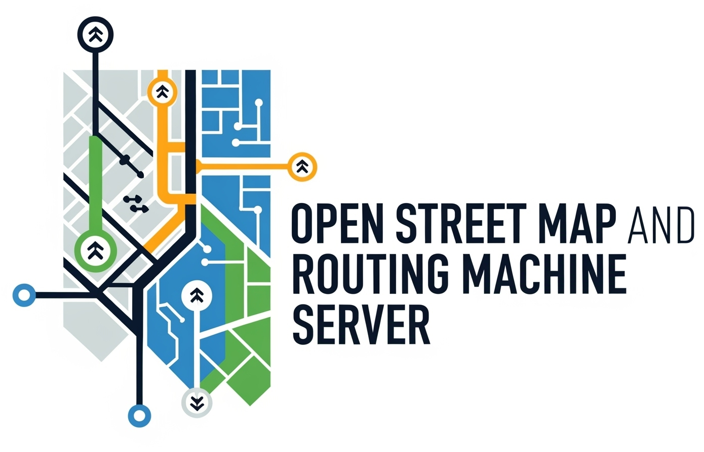

# Open Journey Planner Server



[](https://gitlab.com/opentasmania/ojp-server/-/releases)

[](https://gitlab.com/opentasmania/ojp-server/-/tags)

**Date:** 2025-06-26

**Primary Maintainer:** [Peter Lawler (relwalretep@gmail.com)](mailto:relwalretep@gmail.com)]

**Location Context:** Developed with a focus on Tasmania, Australia, but adaptable for other regions.

**Licence:** [LGPL3+](LICENCE.txt)

## 1. Overview

This project provides a complete self-hosted OpenStreetMap system. It
ingests [OpenStreetMap](https://www.openstreetmap.org/) (OSM) data for base maps and routing networks. The system serves
map tiles (both vector and raster), provides turn-by-turn routing (including for routes
via [OSRM](https://project-osrm.org/)). It adds [GTFS](https://gtfs.org/) data as an example of additional data that can
be ingested and makes this data queryable through
a [PostgreSQL](https://www.postgresql.org/)/[PostGIS](https://postgis.net/) database.

The entire stack is designed to run on a dedicated [Debian 13 "Trixie"](http://debian.org/) system.

## 2. System Architecture

The system is deployed on a GNU/Linux system with the following key components:

* **Development Environment:** [Python](https://www.python.org/) package (`gtfs_processor`) managed with `uv` and
  defined by `pyproject.toml`, suitable for development in IDEs like [PyCharm](https://www.jetbrains.com/pycharm/).
* **Database:**
    * PostGIS with HStore extensions for storing OSM and GTFS data.
    * pgAdmin for database administration through a web interface. (Work in progress)
    * pgAgent for scheduling and executing PostgreSQL jobs. (Work in progress)
* **Routing Engine:**
    * The `osrm/osrm-backend` [Docker](https://www.docker.com/) image is used, primarily due to dependency issues in
      development.
    * [OSM PBF](https://wiki.openstreetmap.org/wiki/PBF_Format) data is preprocessed using tools within the Docker
      image.
    * `osrm-routed` runs inside a Docker container managed by a `systemd` service, exposing port 5000 locally.
* **Map Tile Serving:**
    * Vector Tiles via [pg_tileserv](https://github.com/CrunchyData/pg_tileserv) serving vector tiles directly from
      PostGIS. Runs as a `systemd` service.
    * Raster Tiles via a classic OpenStreetMap stack ([Mapnik](https://mapnik.org/), `renderd` tile rendering daemon,
      `mod_tile` serving raster tiles with [Apache2](https://httpd.apache.org/), OpenStreetMap-Carto stylesheet for
      rendering. Runs as a `systemd` service (typically on port 8080 if Nginx is primary).
* **Web Access:** [nginx](https://nginx.org/) as a reverse proxy for all services.
* **SSL Certificate:**
    * **Production:** [Certbot](https://certbot.eff.org/) (typically on ports 80/443), routing requests to the
      appropriate backend services (`pg_tileserv`, Apache/`mod_tile`, OSRM). Handles SSL termination.
    * **Local/Development:** Self-signed certificates are automatically generated and used for HTTPS.

* **GTFS Data Management:**
    * Automated download and import of GTFS static feeds into PostGIS.
    * Python-based [ETL pipeline](https://en.wikipedia.org/wiki/Extract,_transform,_load) for processing, validating,
      cleaning GTFS data, and handling problematic records via
      [Dead-Letter Queues](https://en.wikipedia.org/wiki/Dead_letter_queue) (DLQ).
    * A cron job triggers updates.
    * (Future) GTFS-Realtime processing.
* **UFW (Uncomplicated Firewall):** Configured for basic security.
* **Other Data Sources**
    * Investigate using other file formats for known routing paths.

## 3. Setup Instructions

### Quick Start

#### Kubernetes-Based Installation

The installation method isusing Kubernetes, either with MicroK8s for local development or a full Kubernetes cluster for
production deployments.

1. Install MicroK8s (for local development):

```bash
sudo snap install microk8s --classic
sudo usermod -a -G microk8s $USER
sudo chown -f -R $USER ~/.kube
newgrp microk8s
microk8s status --wait-ready
microk8s enable dns storage ingress registry
```

2. Use the [Kubernetes installer](kubernetes_installer.py) script.

```bash
# Interactive menu
python3 install_kubernetes.py

# Or deploy directly
python3 install_kubernetes.py deploy --env local
```

3. Creating Custom Installer Images:

The Kubernetes installer can create custom Debian installer images with the OJP Server scripts pre-installed:

- **AMD64 Installer Image**:
  ```bash
  python3 install_kubernetes.py build-amd64
  ```
  This creates a bootable ISO file (`debian-trixie-amd64-microk8s-unattended.iso`) that will automatically install
  Debian with MicroK8s and the OJP Server Kubernetes configurations.

- **Raspberry Pi Installer Image**:
  ```bash
  python3 install_kubernetes.py build-rpi64
  ```
  This creates a Raspberry Pi image file (`debian-trixie-rpi64-microk8s-unattended.img`) for Raspberry Pi 3 or 4 (
  64-bit) with MicroK8s and OJP Server pre-installed.

- **Debian Package**:
  ```bash
  python3 install_kubernetes.py build-deb
  ```
  This creates a standalone Debian package containing the Kubernetes configurations that can be installed on any
  Debian-based system.

All installer images are saved in the `images/` directory. These custom images provide a convenient way to deploy OJP
Server on new systems without manual installation steps.

For more details on the Kubernetes deployment and installer images, see
the [Kubernetes documentation](docs/kubernetes.md).

For help with the Kubernetes installer:

```bash
python3 install_kubernetes.py --help
```

This will display help for the Kubernetes installer, showing available commands and options:

```
usage: kubernetes_installer.py [-h] [--env ENV] [--images [IMAGES ...]] [-v] [-d] [--overwrite] [--production]
                             {deploy,destroy,build-amd64,build-rpi64,build-deb,menu} ...

Kubernetes deployment script for OJM.

positional arguments:
  {deploy,destroy,build-amd64,build-rpi64,build-deb,menu}
                        The action to perform.

options:
  -h, --help            show this help message and exit
  --env ENV             The environment to target (e.g., 'local', 'staging'). Cannot be used with --production.
  --images [IMAGES ...] A space-delimited list of images to deploy or destroy. If not provided, all images will be processed.
  -v, --verbose         Enable verbose output.
  -d, --debug           Enable debug mode (implies --verbose and pauses before each step).
  --overwrite           Force overwrite of existing Docker images in the local registry. Only valid with 'deploy' action.
  --production          Target the production environment. Cannot be used with --env.
```

---

## 4. History

This project started out in late 2023 as a tool to help optimise travel patterns to purchase household goods
after becoming dissatisfied with commercial offerings. While the publicly available OSM/OSRM could be usable, there
was consideration given to how it might be useful in [Home Assistant](https://home-assistant.io). It became increasingly
clear a lot of data verification could be handled by python libraries and the system moved to docker.

In 2024, reliance on microk8s was removed, and the code base cleaned and documentation for such was removed -
although some may linger in the dark recesses somewhere. While it's intended at some stage to bring back microk8s, due
to the thoughts of having this run on Home Assistant for now the project intends to be dockerizing everything.

In 2025, the reliance on shell scripting was reduced to the point where it was removed in early May. Initial release was
intended to make use of Issues boards on a hosted git server, as well as continuous integration build testing. This
included a rewrite into python to help establish more formal documentation, and was never intended to be the final
system. This code is now being removed in favour of the microk8s/kubernetes method as it provides far greater stability
and scalability for a project with a large number of complex dependencies.

## 5. Future

Theres a [Todo list](docs/TODO.md), which is automatically generated from comments found in the code.
Planned [enhancements](https://gitlab.com/opentasmania/ojp-server/-/issues/?label_name%5B%5D=Enhancement) can also be
found on the Gitlab site.

## 6. Support

There's an [issues](https://gitlab.com/opentasmania/ojp-server/-/issues) board where you can submit bugs.
A [Revolt server])(https://revolt.chat) is being worked on, but not yet launched. An FAQ is planned, as well
as a Wiki.

## 7. Contributions

Contributions welcome. Please see the [Contributions](docs/CONTRIBUTING.md) file for more details.

## 8. Developer Guidelines

For detailed development guidelines, including build/configuration instructions, testing information, and additional
development information, please see the [Developer Guidelines](.junie/guidelines.md) file.
